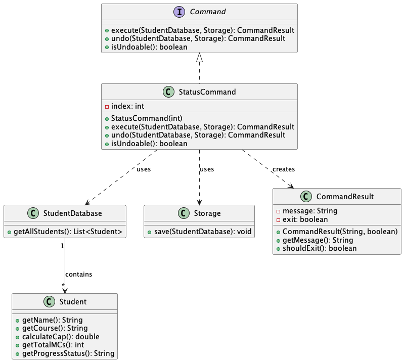
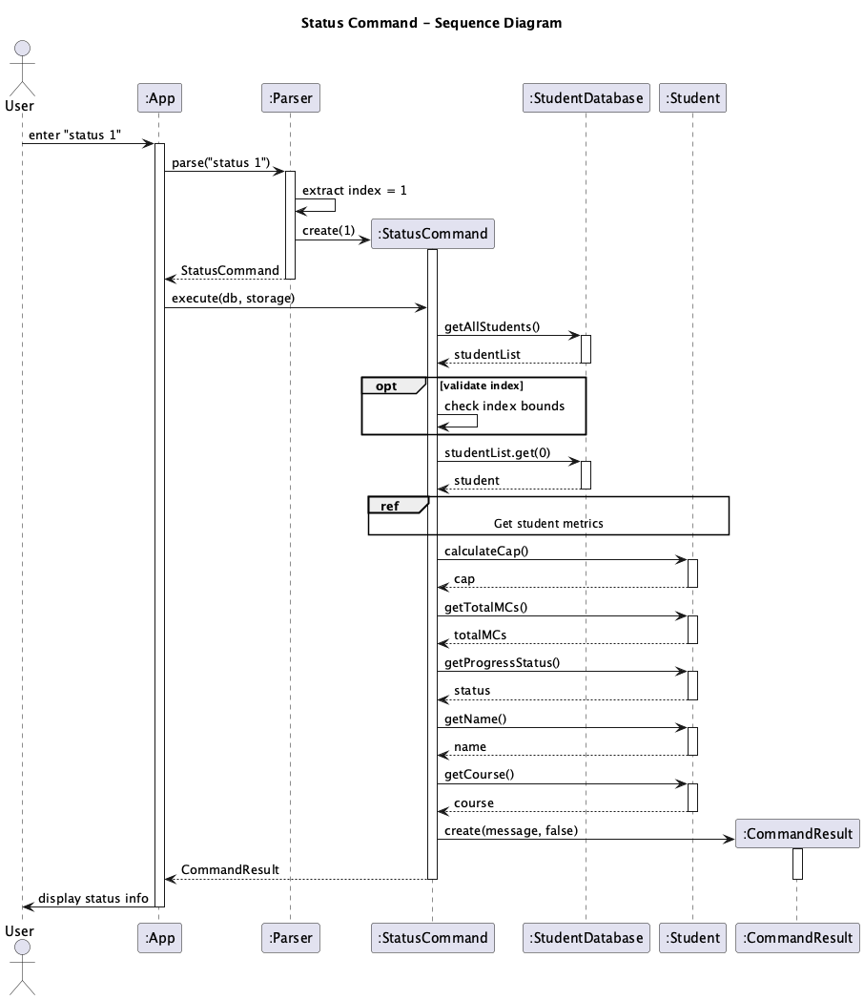

# Developer Guide

## Acknowledgements

{list here sources of all reused/adapted ideas, code, documentation, and third-party libraries -- include links to the original source as well}

## Design & implementation

{Describe the design and implementation of the product. Use UML diagrams and short code snippets where applicable.}

### Implementation: Matthias

#### Status Command

The `StatusCommand` allows users to view detailed information about a specific student, including their CAP, total MCs completed, and progress status.

##### Class Diagram

The class diagram shows the relationship between `StatusCommand` and other components:
- `StatusCommand` implements the `Command` interface
- It interacts with `StudentDatabase` to retrieve student information
- It uses the `Storage` component for persistence operations
- Returns a `CommandResult` containing the status information

##### Sequence Diagram

The sequence diagram illustrates the execution flow:
1. User executes the status command with a student index
2. `StatusCommand.execute()` is called with the `StudentDatabase` and `Storage`
3. The command validates the index and retrieves the student
4. Student information (CAP, MCs, status) is calculated and formatted
5. A `CommandResult` is returned with the formatted status message

#### Undo Command

The `UndoCommand` allows users to revert the last undoable command that modified the student database.

##### Class Diagram

The class diagram shows the relationship between `UndoCommand` and other components:
- `UndoCommand` implements the `Command` interface
- It maintains a reference to `CommandHistory` which tracks executed commands
- It interacts with `StudentDatabase` and `Storage` to perform the undo operation
- Returns a `CommandResult` indicating the undo operation result

##### Sequence Diagram

The sequence diagram illustrates the execution flow:
1. User executes the undo command
2. `UndoCommand.execute()` is called with the `StudentDatabase` and `Storage`
3. The command checks if there are any commands to undo in the `CommandHistory`
4. If available, the last command is popped from the history
5. The `undo()` method of the last command is invoked
6. A `CommandResult` is returned indicating the success or failure of the undo operation

## Product scope
### Target user profile

{Describe the target user profile}

### Value proposition

{Describe the value proposition: what problem does it solve?}

## User Stories

|Version| As a ... | I want to ... | So that I can ...|
|--------|----------|---------------|------------------|
|v1.0|new user|see usage instructions|refer to them when I forget how to use the application|
|v2.0|user|find a to-do item by name|locate a to-do without having to go through the entire list|

## Non-Functional Requirements

{Give non-functional requirements}

## Glossary

* *glossary item* - Definition

## Instructions for manual testing

{Give instructions on how to do a manual product testing e.g., how to load sample data to be used for testing}
